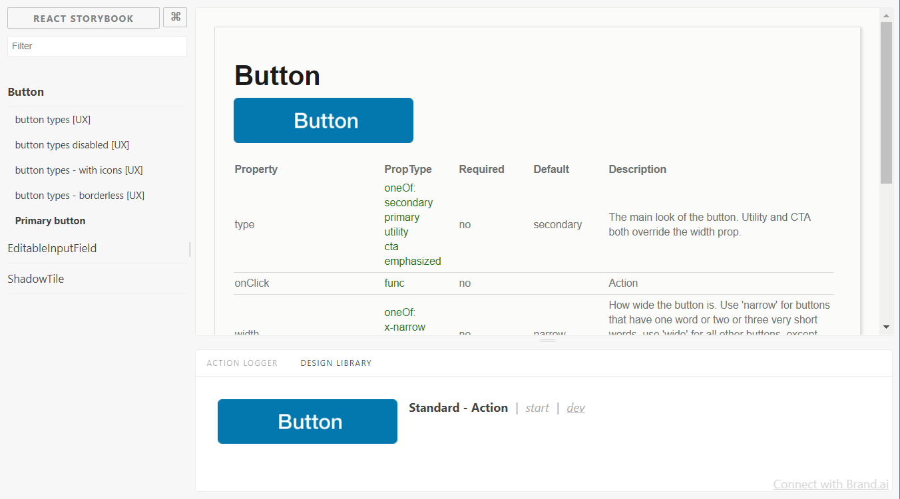
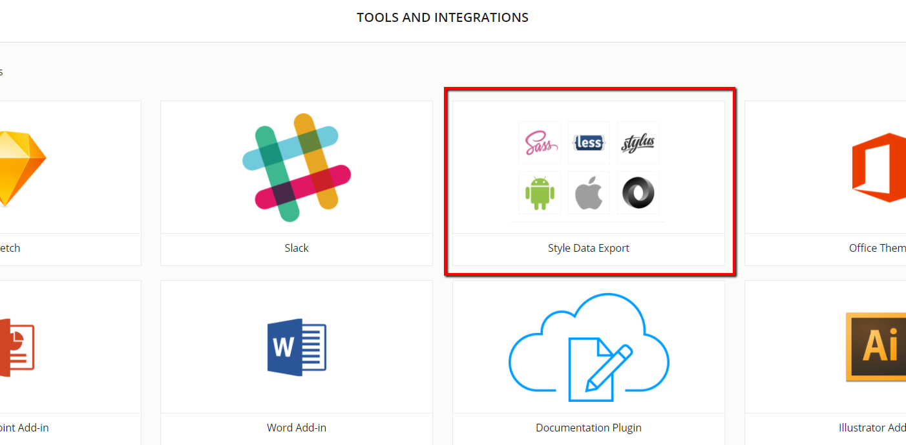
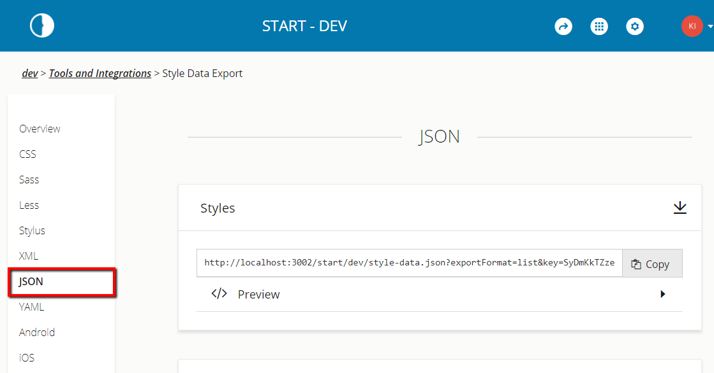
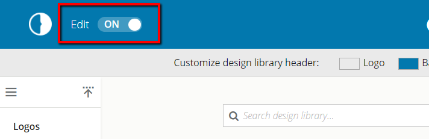
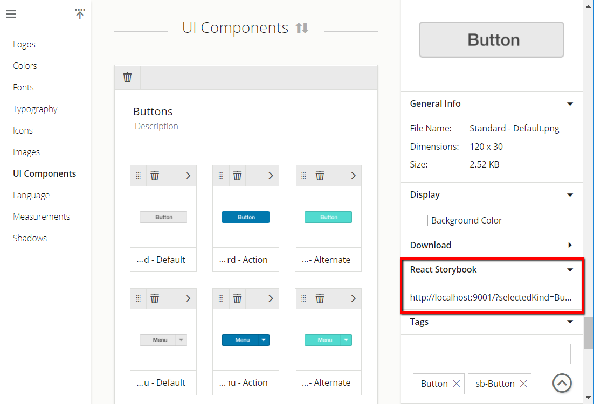

# Storybook Brand.ai viewer

The Brand.ai viewer displays UI Components from a Brand.ai Design Library in [Storybook](https://github.com/storybooks/storybook).  



## Getting Started

Install:

Storybook 2.x
```sh
npm install --save-dev brandai-storybook@<1.0.0
```

Storybook 3.x
```sh
npm install --save-dev brandai-storybook
```

Create a file called `addons.js` in your storybook config (default: `.storybook`) and add the following to `addon.js` :  

Storybook 2.x
```javascript
import '@kadira/storybook/addons'
import register from 'brandai-storybook';
register({ dataUrl:'<brandai-data-export-url>' });
```
Storybook 3.x
```javascript
import '@storybook/react/addons';
import register from 'brandai-storybook';
register({ dataUrl:'<brandai-data-export-url>' });
```

### Connecting to Brand.ai
In order to obtain the url required to connect to brand.ai, you first need to navigate to [Brand.ai](https://brand.ai) and log in. Once you're logged in, select the design library that you want to connect to React Storybook and click the Tools and Integrations in the header.


From the tools and Integrations page select the Style Data Export application.
 


In the Style Data Export application click on `JSON` in the left navigation menu and copy the Styles url




### Connecting the Brand.ai components to the Storybook. 
Note that you will need edit permissions to the design library to connect components.

1. To connect a component, the design library must be in edit mode


2. Click `UI Components` in the navigation menu and click on a component to see additional information.

3. Copy the story URL from your storybook and paste it into the story URL field




The story URL contains a few pieces of information that we'll use to connect the design library to your storybook
1. The full URL - in read-only mode, the link to your storybook will appear in the design library as a reference to the storybook
2. We extract the story _kind_ and the story _name_ to create a connection between a Brand.ai component and a storybook story.

Note: If you want the same Brand.ai component to be displayed for multiple stories of the same kind, you can paste a partial URL containing only the selectedKind

`http://localhost:9001/?selectedKind=Button`

Refresh your Storybook and you should see a Design Library tab in the Storybook panel 
 
