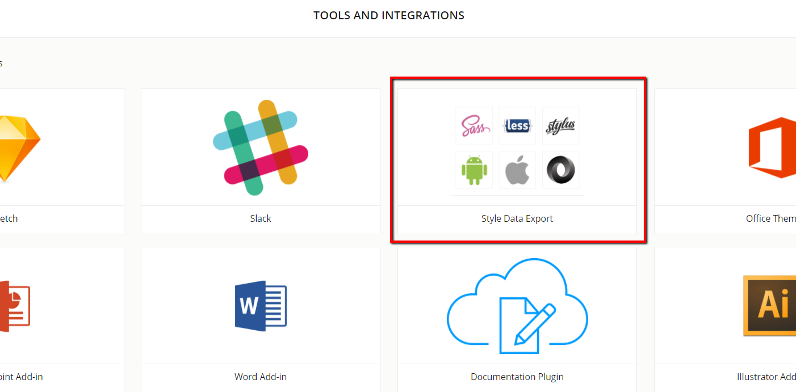
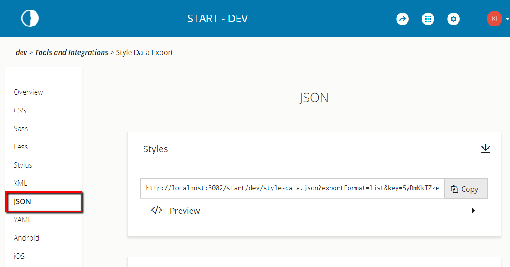

Follow the below steps in order to obtain the url required to connect to brand.ai and connect the Brand.ai components with Storybook.

In order to obtain the url required to connect to brand.ai, you first need to navigate to [Brand.ai](https://brand.ai) and log in. Once you're logged in, select the design library that you want to connect to React Storybook and click the Tools and Integrations in the header.

From the tools and Integrations page select the Style Data Export application.
 

In the Style Data Export application click on `JSON` in the left navigation menu and copy the Styles url

